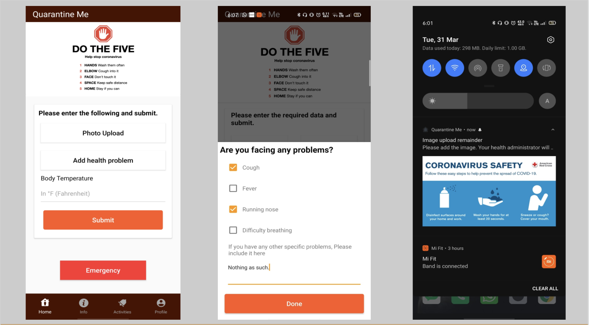
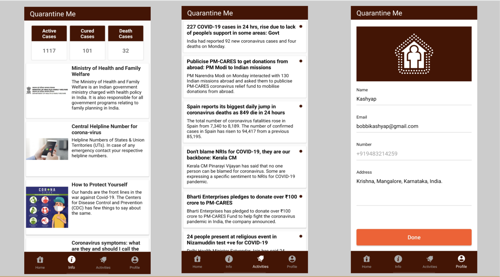

# Quarantine Me

## OVERVIEW:
A small virus named Corona which started in a city called Wuhan located in China has put more than 196 countries and territories in problem leading to more than 22,000 deaths all over the world as on 27th of March, 2020 is now one global pandemic for all of us. For a country like India which is highly populated, it is important to take precautionary measures to avoid a major outbreak which might lead to some of the worst situations that the country hasn’t witnessed yet. 


#### Demo link: 
https://www.youtube.com/watch?v=kE9AclBNPX8&feature=youtu.be

#### PPT link: 
https://docs.google.com/presentation/d/1eRRGSENLPoCpdDRFLEBdDMpfAArCLjpP5cW6TvrdggY/edit?usp=sharing

## Screenshots:

<div align="center">
 
 
</div>

Features
-----

```
It is always told that “Prevention is better than cure”. But with the present situation, we have 
crossed the stage of prevention and it’s all about finding a cure and also avoiding a major outbreak. 
Hopefully the solution that we are providing can help in breaking the chain and helping in getting 
things back to normal. However, this can only be achieved with the help and support of people who 
should be quarantined.

* QMA (Quarantine Management) : A person who is in quarantine.

Initially, we ask the user to have his/her phone with them always so that they can mark their home 
location at first. Then, we will store it with us. After every x minutes, we check the location 
coordinates and match the distance.If they are not in the same location (we will keep a few meters 
threshold), we then send a notification to the handler. So that they don’t go out and harm others, 
preventing the spread of Covid-19. Along with that, every x minutes selfies need to be sent with 
proper background for verification. Also have to decide what to do if he/she is resting. Along with 
selfies, we take user fingerprint/face recognition to identify the user (Have to enroll face/finger
while sign up) Then, we will be  able to raise a signal in case of emergency(button will be present 
in a very easily accessible area of the app). There is a separate place to add his/her temperature 
readings and checkboxes/placeholders to specify,if there are any other information they want to add. 
If he/she is leaving the premises or has forgotten to upload a selfie, he/she will be notified in the 
app as well as a sms for remainder purposes will be sent to the quarantined person. If this quarantined 
person comes in contact with another person who is not infected from Covid-19, then there will be an 
option to raise a request to admin. (have to decide how we will map the users either through their 
phonenumbers or adhar or etc). The admin won't be able to see the location where he/she is, but will
be able to tellif they are outside the zone/ haven't uploaded their selfies. For privacy purposes.

* EMA (Effort Management) : A person who is taking care of quarentees.

Ask the user to have his/her phone with her always.

* CMA (Citizen Management) : A person who is not in quarantine.

Here, we will be having personal remainders for washing hands, not to touch face, to keep safe in dense 
areas and an interface to request for tests and checkups, testing site details if available. If there 
are any doubts, you can ask multiple questions while raising a request for a health practitioner to 
easily access the patient. With these, it also gives data to users about how many are infected, what 
are the measures being taken by the government  etc.. It also shows a heat map of confirmed cases and 
helps these people to understand whether they are safe there.

```

License
=======

    Copyright 2020 Kashyap Bhat

    Licensed under the Apache License, Version 2.0 (the "License");
    you may not use this file except in compliance with the License.
    You may obtain a copy of the License at

       http://www.apache.org/licenses/LICENSE-2.0

    Unless required by applicable law or agreed to in writing, software
    distributed under the License is distributed on an "AS IS" BASIS,
    WITHOUT WARRANTIES OR CONDITIONS OF ANY KIND, either express or implied.
    See the License for the specific language governing permissions and
    limitations under the License.

